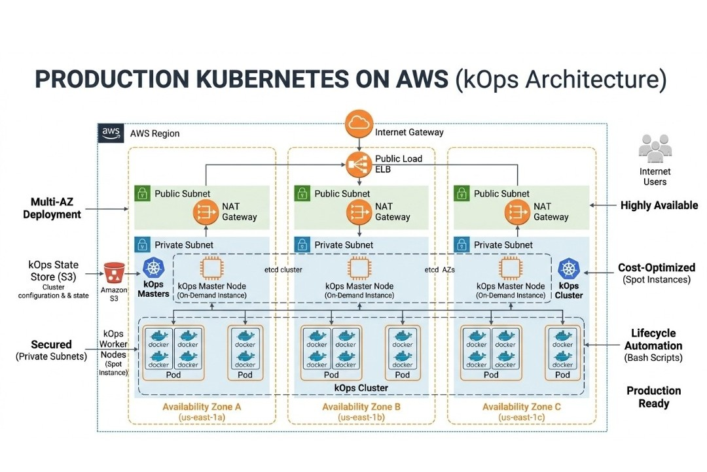

#  Cloud-Native TaskApp — Production Kubernetes Deployment

<div align="center">

**Author:** Ugwuanyi Rita Nnenna  
**GitHub:** [@Ritacloud23](https://github.com/Ritacloud23)  
 Cloud and DevOps Engineer focused on scalable infrastructure, automation, and continuous improvement | Open to Work

[](https://devopsbliss.online)
[](https://devopsbliss.online)
[](LICENSE)

</div>

---

##  Technologies Used

### Core


 


### CI/CD


### Containers & Infrastructure


### Cloud


### Security & Networking


---

##  Table of Contents

- [Project Overview](#-project-overview)
- [Architecture](#-architecture)
- [Repository Structure](#-repository-structure)
- [Infrastructure — Terraform](#-infrastructure--terraform)
- [Kubernetes Cluster — kops](#-kubernetes-cluster--kops)
- [Application Deployment](#-application-deployment)
- [SSL & Ingress](#-ssl--ingress)
- [GitOps with ArgoCD](#-gitops-with-argocd)
- [Database — AWS RDS](#-database--aws-rds)
- [Security](#-security)
- [Quickstart Guide](#-quickstart-guide)
- [Validation Evidence](#-validation-evidence)
- [Cost Analysis](#-cost-analysis)
- [Lessons Learned](#-lessons-learned)

---

##  Project Overview

This capstone project deploys a full-stack cloud-native task management platform — **TeamFlow** — to production AWS infrastructure using industry-standard DevOps practices.

### Application Components

| Component | Technology | Replicas |
|-----------|-----------|---------|
| Frontend | React + Vite + TypeScript | 2 |
| Backend | Flask + SQLAlchemy + Python 3.11 | 2 |
| Database | AWS RDS PostgreSQL 15 | Managed |

### Key Infrastructure Features

- ✅ Multi-master Kubernetes cluster across **3 Availability Zones**
- ✅ **Private subnet topology** — worker nodes have no public IPs
- ✅ All AWS infrastructure defined as **Infrastructure as Code** (Terraform)
- ✅ Remote Terraform state in **S3 with DynamoDB locking**
- ✅ **GitOps** deployment pipeline via ArgoCD — every `git push` auto-deploys
- ✅ Automated **SSL/TLS** via cert-manager + Let's Encrypt
- ✅ **DNS delegation** via AWS Route 53
- ✅ **AWS RDS PostgreSQL** — managed, persistent, automatically backed up
- ✅ **Spot instance** worker node for cost optimization

---

## Architecture

### High-Level Architecture Diagram

<p align="center">
  
</p>

### Network Architecture

```text
VPC: 172.20.0.0/16 (k8s.devopsbliss.online)
│
├── Public Subnets (Load Balancers, NAT Gateways)
│   ├── us-east-1a: 172.20.0.0/21   (utility subnet)
│   ├── us-east-1b: 172.20.8.0/21   (utility subnet)
│   └── us-east-1c: 172.20.16.0/21  (utility subnet)
│
└── Private Subnets (Masters, Workers, RDS)
    ├── us-east-1a: 172.20.64.0/18
    ├── us-east-1b: 172.20.128.0/18
    └── us-east-1c: 172.20.192.0/18
```

**CIDR Allocation Rationale:**
- `/16` supernet provides 65,536 addresses with room for cluster growth
- Public `/21` subnets (2,048 addresses each) — sufficient for load balancers and NAT Gateways
- Private `/18` subnets (16,384 addresses each) — large enough for node pools, pod CIDRs, and future expansion without overlap

### High Availability Strategy

| Component | HA Implementation |
|-----------|------------------|
| Control Plane | 3 master nodes across 3 AZs — survives loss of 1 master |
| Workers | 3+ nodes across 3 AZs — pods reschedule on node loss |
| Database | RDS automated backups, 7-day retention |
| NAT Gateways | One per AZ — no single point of failure for outbound traffic |
| Ingress | nginx replicated across nodes — LB health checks route around failures |
| etcd | Distributed quorum across 3 masters |

### Kubernetes Cluster Nodes

| Node | Role | AZ | Internal IP |
|------|------|----|-------------|
| i-00f811567efd40f47 | control-plane | us-east-1a | 172.20.220.53 |
| i-06b814c1201e9ede4 | control-plane | us-east-1b | 172.20.168.147 |
| i-0e38898cb9689eced | control-plane | us-east-1c | 172.20.95.164 |
| i-079bc89673a44f449 | node | us-east-1a | 172.20.151.143 |
| i-0af25d5d66a3670a9 | node | us-east-1b | 172.20.104.211 |
| i-02219e969a87ae023 | node, spot-worker | us-east-1c | 172.20.244.83 |

> ✅ All nodes use **private IPs only** — no public IP addresses on masters or workers.

---

##  Repository Structure

```
cloud-native-taskapp/
├── .github/
│   └── workflows/
│       └── ci-cd.yml              # GitHub Actions pipeline
│
├── terraform/
│   ├── bootstrap/                 # S3 state bucket + DynamoDB lock table
│   │   ├── main.tf
│   │   ├── variables.tf
│   │   └── outputs.tf
│   ├── envs/
│   │   └── prod/                  # Production infrastructure
│   │       ├── main.tf            # VPC, subnets, NAT, routing
│   │       ├── rds.tf             # AWS RDS PostgreSQL
│   │       ├── variables.tf
│   │       ├── outputs.tf
│   │       └── terraform.tfvars   # gitignored — contains secrets
│   └── modules/
│       ├── dns/                   # Route 53 module
│       ├── iam/                   # IAM roles module
│       └── s3/                    # S3 bucket module
│
├── kops/                          # Cluster specification
│
├── k8s/                           # Kubernetes manifests
│   ├── backend-deployment.yaml
│   ├── backend-service.yaml
│   ├── frontend-deployment.yaml
│   ├── frontend-service.yaml
│   ├── postgres-deployment.yaml
│   ├── taskflow-ingress.yaml
│   └── clusterissuer.yaml
│
├── taskapp_frontend/              # React application
│   ├── Dockerfile
│   ├── nginx-production.conf
│   ├── .env.production
│   └── src/
│
├── taskapp_backend/               # Flask application
│   └── Dockerfile
│
├── argocd-app.yaml                # ArgoCD Application manifest
├── clusterissuer.yaml             # cert-manager ClusterIssuer
├── docs/
│   ├── architecture.md
│   ├── runbook.md
│   └── cost-analysis.md
└── README.md
```

---

##  Infrastructure — Terraform

### Remote State Configuration

Terraform state is stored remotely in S3 with DynamoDB locking to prevent concurrent modifications:

```hcl
terraform {
  backend "s3" {
    bucket         = "cloud-native-taskapp-prod-tfstate"
    key            = "prod/network/terraform.tfstate"
    region         = "us-east-1"
    dynamodb_table = "cloud-native-taskapp-prod-tf-locks"
    encrypt        = true
  }
}
```

### Step 1 — Bootstrap State Backend

```bash
cd terraform/bootstrap
terraform init
terraform apply
```

### Step 2 — Provision Production Infrastructure

```bash
cd terraform/envs/prod
terraform init
terraform plan
terraform apply
```

**Resources provisioned:**

| Resource | Count | Details |
|----------|-------|---------|
| VPC | 1 | 172.20.0.0/16 |
| Public Subnets | 3 | One per AZ |
| Private Subnets | 3 | One per AZ |
| Internet Gateway | 1 | Public internet access |
| NAT Gateways | 3 | One per AZ — HA outbound |
| Elastic IPs | 3 | For NAT Gateways |
| Route Tables | 4 | 1 public + 3 private |
| RDS Instance | 1 | PostgreSQL 15, db.t3.micro |
| RDS Subnet Group | 1 | Private subnets |
| Security Group (RDS) | 1 | Port 5432, VPC CIDR only |

> **Immutability principle:** No manual AWS console changes. All infrastructure changes go through `terraform plan` → `terraform apply` → Git commit.

---

##  Kubernetes Cluster — kops

### Cluster Specifications

| Property | Value |
|----------|-------|
| Cluster name | k8s.devopsbliss.online |
| Kubernetes version | v1.35.3 |
| Control plane nodes | 3 × t3.medium (one per AZ) |
| Worker nodes | 2 × t3.medium + 1 × spot instance |
| CNI | Calico (supports NetworkPolicy) |
| Topology | Private (nodes in private subnets only) |
| DNS | Route 53 |

### Validate Cluster

```bash
kops validate cluster \
  --name k8s.devopsbliss.online \
  --state s3://your-kops-state-bucket
```

Expected output:
```
Your cluster k8s.devopsbliss.online is ready
```

---

##  Application Deployment

### Deploy All Manifests

```bash
kubectl apply -f k8s/
```

### Frontend Dockerfile — Build-Time Env Injection

```dockerfile
FROM node:18 AS builder
WORKDIR /app
COPY package*.json ./
RUN npm install
COPY . .
ARG VITE_API_URL=/api
ENV VITE_API_URL=$VITE_API_URL
RUN npm run build

FROM nginx:alpine
COPY nginx-production.conf /etc/nginx/conf.d/default.conf
COPY --from=builder /app/dist /usr/share/nginx/html
EXPOSE 80
CMD ["nginx", "-g", "daemon off;"]
```

### Set Backend Environment Variables

```bash
kubectl set env deployment/backend -n taskflow \
  DATABASE_HOST=taskflow-prod-db.c4huuae48bqz.us-east-1.rds.amazonaws.com \
  DATABASE_PORT=5432 \
  DATABASE_NAME=taskapp \
  DATABASE_USER=taskapp_user \
  DATABASE_PASSWORD=<your-password>
```

### Initialise Database Schema

```bash
kubectl exec -n taskflow deployment/backend -- python -c "
from app import create_app, db
app = create_app()
with app.app_context():
    db.create_all()
    print('Tables created successfully')
"
```

---

## 🔒 SSL & Ingress

### cert-manager ClusterIssuer

```yaml
apiVersion: cert-manager.io/v1
kind: ClusterIssuer
metadata:
  name: letsencrypt-prod
spec:
  acme:
    server: https://acme-v02.api.letsencrypt.org/directory
    email: ugwuanyinnenna43@gmail.com
    privateKeySecretRef:
      name: letsencrypt-prod
    solvers:
    - http01:
        ingress:
          class: nginx
```

### Ingress Configuration

```yaml
apiVersion: networking.k8s.io/v1
kind: Ingress
metadata:
  name: taskflow-ingress
  namespace: taskflow
  annotations:
    nginx.ingress.kubernetes.io/ssl-redirect: "true"
    cert-manager.io/cluster-issuer: "letsencrypt-prod"
spec:
  ingressClassName: nginx
  tls:
  - hosts:
    - devopsbliss.online
    secretName: devopsbliss-tls
  rules:
  - host: devopsbliss.online
    http:
      paths:
      - path: /api
        pathType: Prefix
        backend:
          service:
            name: backend-service
            port:
              number: 5000
      - path: /
        pathType: Prefix
        backend:
          service:
            name: frontend-service
            port:
              number: 80
```

### DNS Architecture

```
Domain Registrar → NS delegation → Route 53 Hosted Zone (devopsbliss.online)
                                         │
                          ┌──────────────┴──────────────┐
                          │                             │
                    A record (apex)              CNAME (ACM validation)
                    → NLB endpoint               → _aa0ecc4395c96d27a...
```

---

## 🔄 GitOps with ArgoCD

### How GitOps Works

```
Developer pushes code
        │
        ▼
GitHub Repository (main branch)
        │
        │  ArgoCD polls every 3 minutes
        ▼
ArgoCD detects drift between Git and cluster
        │
        ▼
ArgoCD auto-syncs cluster to match Git state
        │
        ▼
Rolling update — zero downtime deployment
```

### Install ArgoCD

```bash
kubectl create namespace argocd
kubectl apply -n argocd \
  -f https://raw.githubusercontent.com/argoproj/argo-cd/stable/manifests/install.yaml
kubectl apply -f argocd-app.yaml
```

### Access ArgoCD UI

```bash
# Get admin password
kubectl get secret argocd-initial-admin-secret -n argocd \
  -o jsonpath="{.data.password}" | base64 -d

# Port forward
kubectl port-forward svc/argocd-server -n argocd 8080:443
```

Open `https://localhost:8080` → login with `admin` and the password above.

### ArgoCD Application Manifest

```yaml
apiVersion: argoproj.io/v1alpha1
kind: Application
metadata:
  name: taskflow
  namespace: argocd
spec:
  project: default
  source:
    repoURL: https://github.com/Ritacloud23/cloud-native-taskapp
    targetRevision: HEAD
    path: .
    directory:
      recurse: true
      include: '*.yaml'
      exclude: 'argocd-app.yaml'
  destination:
    server: https://kubernetes.default.svc
    namespace: taskflow
  syncPolicy:
    automated:
      prune: true
      selfHeal: true
    syncOptions:
    - CreateNamespace=true
```

---

##  Database — AWS RDS

### Why RDS over In-Cluster PostgreSQL

| Feature | In-Cluster PostgreSQL | AWS RDS |
|---------|----------------------|---------|
| Data persistence | Lost on pod deletion | ✅ Persistent, managed |
| Automated backups | Manual | ✅ 7-day retention |
| Failover | Manual | ✅ Automated |
| Patching | Manual | ✅ AWS-managed |
| Monitoring | Manual | ✅ CloudWatch metrics |

### Terraform RDS Configuration

```hcl
resource "aws_db_instance" "postgres" {
  identifier        = "taskflow-prod-db"
  engine            = "postgres"
  engine_version    = "15"
  instance_class    = var.db_instance_class    # db.t3.micro
  allocated_storage = var.db_allocated_storage  # 20 GB
  db_name           = var.db_name
  username          = var.db_username
  password          = var.db_password           # sensitive — never in Git
  publicly_accessible     = false
  backup_retention_period = 7
}
```

> RDS is in a **private subnet** and is **not publicly accessible**. Only resources within the kops VPC CIDR (172.20.0.0/16) can reach it on port 5432.

---

##  Security

### Network Security
- ✅ **Private subnet topology** — masters and workers have no public IPs
- ✅ **NAT Gateways** handle outbound internet from private subnets (one per AZ)
- ✅ **Security groups** restrict RDS to VPC CIDR only — not `0.0.0.0/0`
- ✅ **nginx Ingress** is the single public entry point
- ✅ **HTTP → HTTPS redirect** enforced at Ingress level

### IAM
- ✅ No root account usage
- ✅ Separate IAM roles for cluster creation vs. cluster operations
- ✅ EC2 instance profiles — no hardcoded AWS credentials
- ✅ Least-privilege policies per service

### Secrets Management
- ✅ Database password is `sensitive = true` in Terraform
- ✅ `terraform.tfvars` is in `.gitignore` — never committed
- ✅ Backend env vars set via `kubectl set env` — not in manifests
- ✅ `.env.production` contains only `VITE_API_URL=/api` — no secrets
- ✅ No passwords or tokens committed to Git at any point

### SSL/TLS
- ✅ Valid Let's Encrypt certificate (not self-signed)
- ✅ Auto-renewal managed by cert-manager
- ✅ TLS termination at Ingress level
- ✅ `ssl-redirect: "true"` enforces HTTPS-only access

---

## ⚡ Quickstart Guide

### Prerequisites

```bash
aws --version      # AWS CLI configured
kubectl version    # kubectl installed
terraform version  # >= 1.5.0
kops version       # kops installed
docker --version   # Docker installed
```

### 1. Clone the Repository

```bash
git clone https://github.com/Ritacloud23/cloud-native-taskapp
cd cloud-native-taskapp
```

### 2. Bootstrap Terraform State

```bash
cd terraform/bootstrap
terraform init && terraform apply
```

### 3. Provision Infrastructure

```bash
cd terraform/envs/prod
# Create terraform.tfvars (never commit this file)
echo 'db_password = "your-secure-password"' > terraform.tfvars
terraform init && terraform plan && terraform apply
```

### 4. Configure kubectl

```bash
kops export kubecfg \
  --name k8s.devopsbliss.online \
  --state s3://your-kops-state-bucket
kubectl get nodes
```

### 5. Deploy ArgoCD + Application

```bash
kubectl create namespace argocd
kubectl apply -n argocd \
  -f https://raw.githubusercontent.com/argoproj/argo-cd/stable/manifests/install.yaml
kubectl apply -f argocd-app.yaml
kubectl apply -f clusterissuer.yaml
```

### 6. Set Database Variables

```bash
kubectl set env deployment/backend -n taskflow \
  DATABASE_HOST=$(terraform -chdir=terraform/envs/prod output -raw rds_endpoint | cut -d: -f1) \
  DATABASE_PORT=5432 \
  DATABASE_NAME=taskapp \
  DATABASE_USER=taskapp_user \
  DATABASE_PASSWORD=your-secure-password
```

### 7. Initialise Database

```bash
kubectl exec -n taskflow deployment/backend -- python -c "
from app import create_app, db
app = create_app()
with app.app_context():
    db.create_all()
    print('Database initialised')
"
```

### 8. Verify & Access

```bash
kubectl get pods -n taskflow          # All Running
kubectl get certificate -n taskflow   # READY: True
kubectl get applications -n argocd    # Synced + Healthy
```

Open **https://devopsbliss.online** ✅

---

## ✅ Validation Evidence

### Cluster Health

```
NAME                  STATUS   ROLES          VERSION   INTERNAL-IP
i-00f811567efd40f47   Ready    control-plane  v1.35.3   172.20.220.53
i-06b814c1201e9ede4   Ready    control-plane  v1.35.3   172.20.168.147
i-0e38898cb9689eced   Ready    control-plane  v1.35.3   172.20.95.164
i-079bc89673a44f449   Ready    node           v1.35.3   172.20.151.143
i-0af25d5d66a3670a9   Ready    node           v1.35.3   172.20.104.211
i-02219e969a87ae023   Ready    node,spot      v1.35.3   172.20.244.83
```

✅ 3 control-plane nodes across 3 AZs | ✅ All nodes use private IPs only

### All Pods Running

```
NAME               READY   STATUS    RESTARTS
backend-xxx        1/1     Running   0
backend-xxx        1/1     Running   0
frontend-xxx       1/1     Running   0
frontend-xxx       1/1     Running   0
```

### SSL Certificate Valid

```
NAME              READY   SECRET            AGE
devopsbliss-tls   True    devopsbliss-tls   6h
```

### ArgoCD Sync Status

```
NAME       SYNC STATUS   HEALTH STATUS
taskflow   Synced        Healthy
```

### Terraform No Drift

```
No changes. Your infrastructure matches the configuration.
```

---

## 💰 Cost Analysis

| Resource | Type | Count | Monthly Est. |
|----------|------|-------|-------------|
| EC2 Masters | t3.medium On-demand | 3 | ~$90.00 |
| EC2 Workers | t3.medium On-demand | 2 | ~$60.00 |
| EC2 Worker | t3.medium **Spot** | 1 | ~$18.00 |
| RDS PostgreSQL | db.t3.micro | 1 | ~$15.00 |
| NAT Gateways | Per AZ | 3 | ~$33.00 |
| Network Load Balancer | NLB | 1 | ~$18.00 |
| Route 53 | Hosted zone | 1 | ~$0.50 |
| S3 | State + kops | 2 | ~$1.00 |
| Data Transfer | Outbound | - | ~$5.00 |
| **Total** | | | **~$240.50/month** |

>  Spot instance on 1 worker saves ~$42/month vs all on-demand. AWS Budget alert set at $50 increments.

---

##  Lessons Learned

**1. CrashLoopBackOff — always check `--previous` logs**
`kubectl logs <pod> --previous` reveals the crash from the last container. nginx was crashing because the config referenced `/etc/letsencrypt/` SSL certs that don't exist inside Docker. Fix: SSL termination at the Ingress level, not the pod.

**2. SSL termination belongs at the Ingress — not the pod**
In Kubernetes, application nginx listens on port 80. SSL is handled by the Ingress controller + cert-manager. Putting SSL inside the pod creates cert management nightmares.

**3. Two ingresses on the same domain conflict silently**
ALB ingress and nginx ingress claiming the same host causes silent routing failures. One ingress controller — one source of truth.

**4. ACM cert validation — verify the CNAME was actually created**
The "Create records in Route 53" button doesn't always work. Always verify the `_` CNAME record exists in your hosted zone before waiting.

**5. cert-manager only acts when the annotation is on the Ingress**
If `cert-manager.io/cluster-issuer` is missing from the applied manifest, cert-manager does nothing — no error, just silence.

**6. Vite env vars are baked at build time — not runtime**
`VITE_API_URL` is compiled into the JS bundle. It must be passed as Docker `ARG` and `ENV`. Changing `.env.production` without rebuilding does nothing.

**7. Docker cache lies when env files change**
`docker build --no-cache` is mandatory when changing env variables. Docker silently serves stale cached builds otherwise.

**8. Terraform VPC and kops VPC must be the same**
RDS provisioned by Terraform must be in the same VPC as the kops cluster. Use `data` sources to reference the existing kops VPC.

---

## 🧹 Cleanup

```bash
# Delete Kubernetes resources
kubectl delete namespace taskflow
kubectl delete namespace argocd

# Destroy AWS infrastructure
cd terraform/envs/prod && terraform destroy

# Destroy state backend (last)
cd ../bootstrap && terraform destroy
```

---

## 👩‍💻 Author

<div align="center">

**Ugwuanyi Rita Nnenna**  
Cloud & DevOps Engineer

[
[
  
🔍 **Open to Work**  Cloud Engineer (AWS, Azure, GCP) | DevOps Engineer

**Skills:** AWS • Terraform • Ansible • Docker • Kubernetes • GitHub Actions • CI/CD • Linux • Bash • Python • Git • CloudWatch • Prometheus • Grafana • VPC • DNS • Load Balancers

</div>

---

*Built as a capstone project demonstrating production-grade Kubernetes deployment on AWS — from infrastructure provisioning to GitOps automation.*
